# Archeon VR Model Viewer


Archeon is an immersive VR application that transforms real-world environments into interactive 3D experiences using cutting-edge Gaussian Splats technology. Capture spaces with your mobile device, process them in the cloud, and experience them in virtual reality.

## ✨ Features

- **📱 Mobile Capture**: Record real environments using the Archeon mobile app
- **🔮 Gaussian Splats Technology**: Advanced AI converts 2D videos to photorealistic 3D models
- **☁️ Cloud Sync**: Seamless synchronization of 3D models via Firebase
- **🕶️ VR Experience**: Immersive viewing with full 6DOF movement support
- **🌐 Web Viewer**: Non-VR browser-based model viewing option
- **🔐 User Authentication**: Secure Firebase-based user management

## 🏗️ Architecture

```
┌─────────────────┐    ┌─────────────────┐    ┌─────────────────┐
│   Mobile App    │──▶│  Cloud AI       │───▶│ Desktop Viewer  │
│   (Recording)   │    │  (Processing)   │    │    (VR/Web)     │
└─────────────────┘    └─────────────────┘    └─────────────────┘
         │                       │                        │
         │              ┌─────────────────┐               │
         └─────────────▶│ Firebase Cloud  │◀─────────────┘
                        │    Storage      │
                        └─────────────────┘
```

## 📁 Repository Structure

```
ArcheonSetup/
├── Archeon.py                    # Main Streamlit application
├── archeon.yaml                  # Conda environment configuration
├── logo-no-background.png        # Application logo
├── viewer/                       # Unity VR viewer application
│   ├── ArcheonViewer.exe         # Main VR viewer executable
│   ├── ArcheonViewer_Data/       # Unity application data
│   ├── MonoBleedingEdge/         # Unity runtime
│   ├── UnityCrashHandler64.exe   # Unity crash handler
│   └── UnityPlayer.dll           # Unity player library
├── web_viewer/                   # Web-based viewer
│   └── GaussianSplats3D/         # Gaussian Splats 3D library
│       ├── package.json          # npm configuration
│       ├── build/                # Built demo files
│       ├── util/                 # Development server utilities
│       └── demo/                 # Demo content
├── downloads/                    # User model storage (created at runtime)
│   └── [user_id]/               # Per-user synchronized content
├── viewer.zip                    # Zipped viewer for distribution
├── .gitignore                    # Git ignore file
└── LICENSE                       # MIT License
```

## 🚀 Quick Start

### Prerequisites

- **Operating System**: Windows 10/11 64-bit
- **Python**: 3.9+
- **Node.js**: 16+ (for web viewer)
- **npm**: Latest version
- **VR Hardware** (optional): Oculus Rift/Quest, HTC Vive, Valve Index
- **Minimum RAM**: 8GB (16GB recommended)
- **Graphics**: NVIDIA GTX 1060 / AMD RX 580 or better

### Installation

1. **Clone the repository**
   ```bash
   git clone <repository-url>
   cd ArcheonSetup
   ```

2. **Create and activate conda environment**
   ```bash
   conda env create -f archeon.yaml
   conda activate archeon
   ```

3. **Setup Web Viewer** (Required for non-VR viewing)
   ```bash
   cd web_viewer/GaussianSplats3D
   npm install  # If dependencies need to be installed
   npm run demo
   ```
   This will start the Gaussian Splats 3D viewer server on `http://localhost:8080`

4. **Run the main application** (in a new terminal)
   ```bash
   # Navigate back to project root
   cd ..
   streamlit run Archeon.py
   ```

5. **Access the web interface**
   - Main app: `http://localhost:8501`
   - Web viewer: `http://localhost:8080` 
   - Log in with your Archeon account credentials

> **Note**: Keep both servers running simultaneously for full functionality. The main Streamlit app handles authentication and file sync, while the web viewer provides browser-based 3D model viewing.

## 💡 How It Works

### 1. **📱 Capture Environments**
- Download the Archeon mobile app
- Record videos of real-world spaces by walking around them
- Upload directly from the mobile app for cloud processing

### 2. **⚙️ AI Processing**
- Advanced computer vision algorithms analyze your video
- Gaussian Splats technology creates photorealistic 3D models
- Processing typically takes 15-30 minutes per environment

### 3. **🔄 Sync & View**
- Use the desktop app to sync processed models to your computer
- Launch the VR viewer for immersive 6DOF exploration
- Or use the web viewer for non-VR experiences

## 🎮 Usage Guide

### Desktop Application

1. **Login**: Use your Archeon account credentials
2. **Model Sync Tab**: 
   - View all your processed 3D environments
   - Click "Sync Models" to download to local storage
3. **Model Viewer Tab**:
   - **Launch Viewer**: Opens the Unity-based VR application
   - **Launch Non-VR Viewer**: Opens web viewer in new browser tab
   - **Launch embedded Non-VR Viewer**: Shows web viewer within the app
4. **Help Tab**: Documentation and troubleshooting

### Viewing Modes

**🕶️ VR Mode (Unity Viewer):**
- Full immersive VR experience
- 6DOF movement and interaction
- Requires VR headset
- Launched via "Launch Viewer" button

**🌐 Web Mode (Browser Viewer):**
- No VR hardware required
- Mouse and keyboard controls
- Runs at `http://localhost:8080`
- Accessible via web viewer buttons or direct browser access

### Web Viewer Setup

The web viewer must be running before using web viewing options:

```bash
cd web_viewer/GaussianSplats3D
npm run demo
```

Keep this terminal open while using the application.

### VR Viewer Controls

- **Movement**: Use VR controllers or headset tracking
- **Scale**: Adjust model size for comfortable viewing
- **Lighting**: Toggle different lighting modes
- **Navigation**: Teleport or smooth locomotion options

## 🛠️ Technical Details

### Supported Formats
- **Input**: Video files from mobile app (.mp4, .mov)
- **3D Models**: Gaussian Splats (.gs files)
- **Web Rendering**: Real-time Gaussian Splats via WebGL
- **Average model size**: 5-50MB
- **Typical processing time**: 15-30 minutes

### System Requirements

**Minimum:**
- Intel i5 / AMD Ryzen 5
- 8GB RAM
- NVIDIA GTX 1060 / AMD RX 580
- 500MB + model storage space

**Recommended:**
- Intel i7 / AMD Ryzen 7
- 16GB RAM
- NVIDIA RTX 3060 / AMD RX 6600 XT
- SSD storage

### Dependencies

**Dependencies:**
- `streamlit` - Web interface framework
- `pyrebase4` - Firebase integration
- `requests` - HTTP client
- `pycryptodome` - Cryptographic functions

**Web Viewer Dependencies:**
- `@mkkellogg/gaussian-splats-3d` - Gaussian Splats 3D rendering library
- Node.js server for serving 3D models
- Modern web browser with WebGL support

**External services:**
- Firebase Authentication
- Firebase Cloud Storage
- Archeon AI Processing Pipeline

## 🔧 Configuration

The application connects to Firebase using predefined configuration. For development or custom deployments, modify the `firebase_config` dictionary in `Archeon.py`:

```python
firebase_config = {
    "apiKey": "your-api-key",
    "authDomain": "your-project.firebaseapp.com",
    "projectId": "your-project-id",
    # ... other config
}
```

## 🐛 Troubleshooting

### Common Issues

**Models appear distorted:**
- Ensure adequate lighting during recording
- Record from multiple angles and positions
- Move slowly and steadily while recording

**Sync fails:**
- Check internet connection
- Verify sufficient disk space
- Try logging out and back in

**VR viewer won't launch:**
- Confirm system requirements are met
- Ensure VR headset is properly connected
- Check that all files synced successfully

**Web viewer not loading:**
- Ensure `npm run demo` is running from `web_viewer/GaussianSplats3D/` directory
- Check that port 8080 is not blocked by firewall
- Verify Node.js and npm are properly installed
- Try refreshing the browser or clearing cache

**Web viewer shows blank page:**
- Confirm models have been synced to local directory
- Check browser console for JavaScript errors
- Ensure WebGL is enabled in your browser

### Support

- **📧 Email**: hamzaaamer6@gmail.com

For questions, issues, or feedback, please reach out via email.

## 📋 Workflow

```mermaid
graph LR
    A["📱 Record with Mobile App"] --> B["☁️ Upload to Cloud"]
    B --> C["🤖 AI Processing"]
    C --> D["💻 Download to Desktop"]
    D --> E["🕶️ View in VR/Web"]
    
    style A fill:#e3f2fd,stroke:#1976d2,stroke-width:2px,color:#000
    style B fill:#f3e5f5,stroke:#7b1fa2,stroke-width:2px,color:#000
    style C fill:#fce4ec,stroke:#c2185b,stroke-width:2px,color:#000
    style D fill:#e8f5e8,stroke:#388e3c,stroke-width:2px,color:#000
    style E fill:#fff3e0,stroke:#f57c00,stroke-width:2px,color:#000
```



## 🛠️ Development

### Running in Development Mode

1. **Start the web viewer development server:**
   ```bash
   cd web_viewer/GaussianSplats3D
   npm install  # If first time setup
   npm run demo  # Starts the Gaussian Splats 3D demo server
   ```

2. **Start the main Streamlit application:**
   ```bash
   # In a new terminal, from project root
   conda activate archeon
   streamlit run Archeon.py
   ```

3. **Access development interfaces:**
   - Main app: `http://localhost:8501`
   - Web viewer: `http://localhost:8080`

### Web Viewer Development

The web viewer uses the Gaussian Splats 3D library (@mkkellogg/gaussian-splats-3d) for browser-based 3D model viewing:

- **Location**: `./web_viewer/GaussianSplats3D/`
- **Start command**: `npm run demo`
- **Technology**: Gaussian Splats 3D rendering in WebGL
- **Integration**: Serves 3D models via HTTP on localhost:8080

## 🤝 Contributing

1. Fork the repository
2. Create a feature branch (`git checkout -b feature/amazing-feature`)
3. Commit your changes (`git commit -m 'Add amazing feature'`)
4. Push to the branch (`git push origin feature/amazing-feature`)
5. Open a Pull Request

## 📄 License

This project is licensed under a customized Academic License - see the [LICENSE](LICENSE) file for details.

## 🙏 Acknowledgments

- Unity Technologies for VR framework
- Firebase for cloud infrastructure
- Streamlit for web interface framework
- @mkkellogg/gaussian-splats-3d library for web-based Gaussian Splats rendering
- The Gaussian Splats research community

---

**Made with ❤️ by the Archeon Team**

*Transform reality into immersive experiences*
